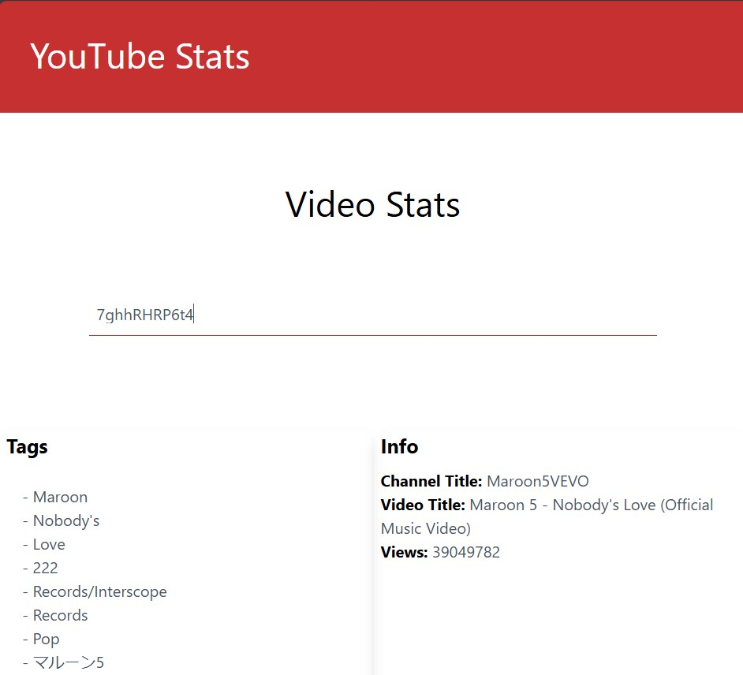

# YOUTUBE STATS WEB APP

### Displays all the tags associated with any youtube video.

## Instructions to run

1. Clone repository
2. Run npm install to install node modules
3. Add your API key in the .env file (replace YOURAPIKEY with your real API Key). Instructions to obtain API key found [here](https://www.slickremix.com/docs/get-api-key-for-youtube/)
4. Run npm start to run app
5. Insert YouTube Video ID into search box and hit enter to retrieve results. You can get the video ID from any YouTube video URL.

## Instructions to Build and Run Docker Image

1. Follow instructions 1 & 3 above.
2. To build image, cd into directory and run `docker build . -t youtubereactapp:latest`
3. To run container enter `docker run --rm -it -p 3000:3000/tcp youtubereactapp:latest`

## Generic Create React App Stuff

This project was bootstrapped with [Create React App](https://github.com/facebook/create-react-app).

## Available Scripts

In the project directory, you can run:

### `yarn start`

Runs the app in the development mode. 
Open [http://localhost:3000](http://localhost:3000) to view it in the browser.

The page will reload if you make edits. 
You will also see any lint errors in the console.

### `yarn test`

Launches the test runner in the interactive watch mode. 
See the section about [running tests](https://facebook.github.io/create-react-app/docs/running-tests) for more information.

### `yarn build`

Builds the app for production to the `build` folder. 
It correctly bundles React in production mode and optimizes the build for the best performance.

The build is minified and the filenames include the hashes. 
Your app is ready to be deployed!

See the section about [deployment](https://facebook.github.io/create-react-app/docs/deployment) for more information.

### `yarn eject`

**Note: this is a one-way operation. Once you `eject`, you can’t go back!**

If you aren’t satisfied with the build tool and configuration choices, you can `eject` at any time. This command will remove the single build dependency from your project.

Instead, it will copy all the configuration files and the transitive dependencies (webpack, Babel, ESLint, etc) right into your project so you have full control over them. All of the commands except `eject` will still work, but they will point to the copied scripts so you can tweak them. At this point you’re on your own.

You don’t have to ever use `eject`. The curated feature set is suitable for small and middle deployments, and you shouldn’t feel obligated to use this feature. However we understand that this tool wouldn’t be useful if you couldn’t customize it when you are ready for it.

## Learn More

### For all the official and non official images:

- [hub.docker.com](https://hub.docker.com/)

### To understand the anatomy of a docker file:

- [Anatomy of a Dockerfile](https://mehlj.github.io/Dockerfile/)
- [Writing a DockerFile](https://docs.docker.com/guides/docker-concepts/building-images/writing-a-dockerfile/)
